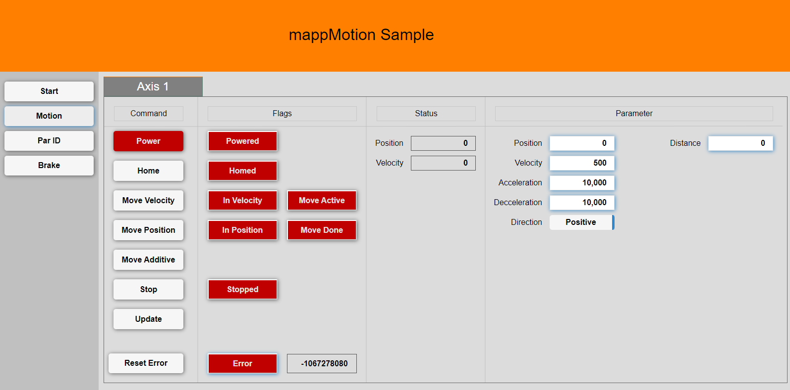

## Introduction
This is project contains several samples for mappMotion.

The samples are broken up in branches to focus on a single function at a time. The chapter always has a link to the branch used at the top. The main branch has a base example with some basic motion functions. This main sample is then expanded to the specific function

This sample can run in simualtion mode (http://127.0.0.1:81/).

## Requirements
* Automation Studio 4.12
* mappView 5.22
* mappServices 5.22

