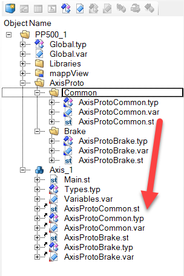

The structure of the samples is build so that every function can be used independently. Each function comes with its own variable and type definitions. All code is in structure text language and encapsulated in an action.

<table>
    <tr>
        <td>
            
        </td>
        <td>
            The folder AxisProto contains all files necessary for the function. It is recommended to reference the files to task instead of copying. A reference makes it easier to update the files in the future.
        </td>
    </tr>
</table>

